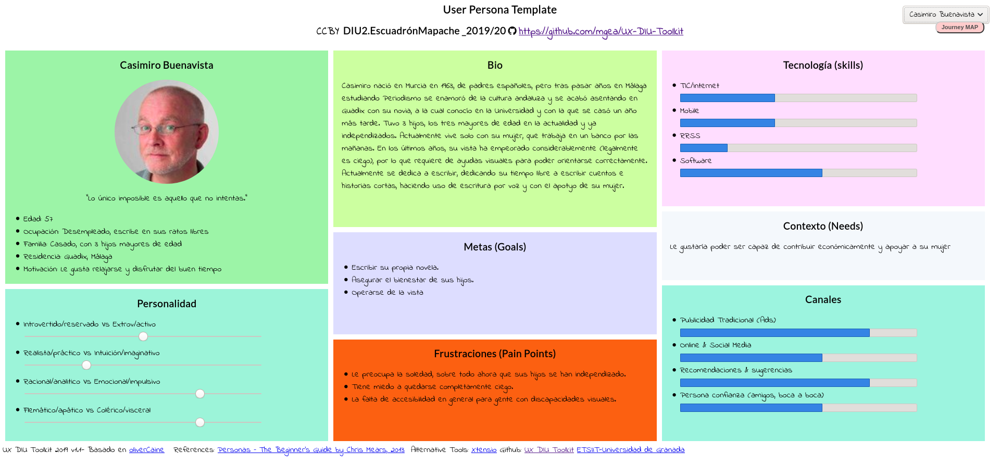
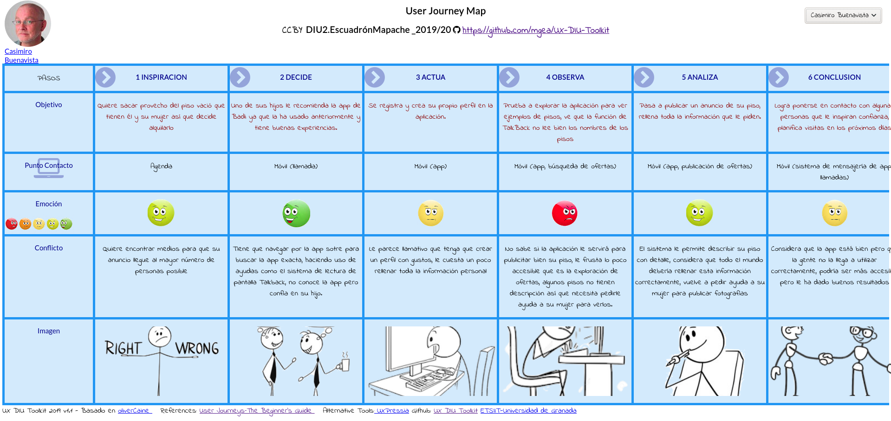

## DIU - Practica1, entregables

- Desk research: Análisis Competencia 
- 2 Personas 
- 2 User Journey Map  ( 1 por persona)
- Revisión de Usabilidad 

----------------------------------------------------

 ## 1.a Desk Research: Competitive Analysis

El objetivo de la práctica será realizar un análisis de aplicaciones para compartir alojamiento - el tipo de aplicaciones que permiten a los usuarios buscar habitaciones y pisos que compartir con otras personas, además de permitir publicar anuncios que puedan ser vistos por otros. Realizamos un análisis de algunas de las apps más populares con el objetivo de ver en cual nos centraremos:

|                                   | Badi | ComparteTuPiso | Habitoom | Idealista |
| --------------------------------- | ---- | -------------- | -------- | --------- |
| Búsqueda de pisos en alquiler     | ✓    | ✓              | ✓        | ✓         |
| Cantidad de inquilinos específica | ✓    |                |          |           |
| De uso gratuito                   | ✓    | ✓              | ✓        | ✓         |
| Múltiples idiomas                 | ✓    |                | ✓        | ✓         |
| Multiplataforma                   | ✓    |                |          | ✓         |
| Plataforma web                    | ✓    | ✓              | ✓        | ✓         |
| Aplicación móvil                  | ✓    |                |          | ✓         |
| Perfiles personalizados           | ✓    |                |          |           |
| Pagos seguros gestionados por app | ✓    |                |          | ✓         |
| Soporte por chat                  | ✓    |                |          | ✓         |
| Sección F.A.Q.                    | ✓    |                | ✓        | ✓         |

De entre todas las opciones contempladas en el análisis competitivo, Badi es la que más ha resaltado. Badi se presenta como una de las opciones más accesibles al ser mmultiplataforma y estar en múltiples idiomas, permitiendo llegar a un mayor público (siendo, de hecho, uno de los primeros resultados al buscar aplicaciones por el estilo).

Badi también implementa un sistema de reservas y pagos seguros que garantiza total seguridad durante las transacciones que se puedan producir. A esto se le añade un sistema de soporte muy eficiente, con sección de Pregunta Frecuentes actualizada cada día y un sistema de consultas y sugerencias con chat en tiempo real, al contrario que el sistema de consultas por correo de otras aplicaciones como ComparteTuPiso o Habitoom.

Badi se diferencia sobre otras aplicaciones en su uso de perfiles personales: el usuario, al registrarse, especifica sus gustos y datos personales relevantes, que luego pueden ser vistos por el resto de usuarios. Esto permite conocer a los usuarios con los que vas a compartir piso o a los que vas a alquilar tu propiedad incluso antes de hablar con ellos, asegurando que el usuario pueda escoger compañeros de piso con los que tenga gustos en común, y así la experiencia sea más personalizada.

Idealista posee muchas de las características antes mencionadas, pero carece de un sistema centrado en el usuario como el de Badi, haciendo de su uso una experiencia menos personal. Por ello, he escogido Badi.

-----------

## 1.b Persona

Esther Píscore: Se ha escogido este usuario para representar a un demográfico bastante común, una juventud sociable y activa, el demográfico al que está dirigido esta aplciación, pero con poca experiencia a la hora de usar aplicaciones específicas, por lo cual podría sufrir problemas a la hora de usar una aplicación que nunca ha usado antes, explorando así temas como los métodos de contacto y las ayudas.

Casimiro Buenavista: Se ha escogido este usuario apra tratar temas de accesibilidad, comúnmente ignorados pero bastantes importantes a la hora de crear una interfaz de usuario disponible para todos. Además, se trata también con un demográfico más externo al que la aplicación podría intentar llegar en un principio, que es el joven.

-----------

## 1.c User Journey Map

Esther Píscore: En la historia de Alexa, se ve que si bien es importante tener un buen sistema de contacto, también es importante promocionarlo bien, además de acompañar las situaciones más complejas y que más problemas puedan dar con explicaciones correctas y fácilmente accesibles fuera de la sección de FAQs. También hay que tener en cuenta casos tan comunes como que el cambio de una página a otra pueda borrar la información, pues son detalles como estos los que marcan o no que la experiencia del usuario sea satisfactoria.

Casimiro Buenaventura: En la historia de Casimiro, se puede ver como el uso de una interfaz más simple y minimalista puede ser bastante útil pero al mismo tiempo dar problemas. Hay que intentar tener en cuenta que clases de problemas de accesibilidad se pueden crear mientras diseñamos nuestra interfaz: si el posicionamiento de los botones, textos... pueden dar a errores, si el contraste de colores puede confundir, que clase de iconos o imágenes usamos para señalar distintas cosas... 

---

## 1.d. Revisión de Usabilidad

Si bien Badi es una aplicación bastante bien construida y a nivel de servicio funciona bien, sufre de algunos errores no muy graves que pueden disminuir la calidad de experiencia de algunos usuarios. Su principal problema a mi parecer, si bien también uno de sus puntos fuertes, es su diseño minimalista. Si bien se pone el énfasis en la información más importante de la página, son muchas las ocasiones en las que se echan en falta opciones de navegación más exactas y siempre accesibles, y también hay momentos en los que se puede ver que la información mostrada no es suficiente. 

Una reestructuración del menú de navegación para incluir opciones más comunes (como las opciones de contacto) y una reestructuración de la información mostrada para hacerla más accesible al usuario, junto con otros cambios de calidad de vida, podrían hacer relucir aún más los puntos fuertes de Badi y mejorar la experiencia de usuario significantemente.

[ Enlace a la Revisión de Usabilidad ](Usability-review.pdf)

