DIU - Practica2, entregables

- Malla receptora de información 
- Sitemap & Task flow 
- Labelling 
- Wireframe & User flow 

----------------------------------------------------

 ## 2.a Feedback Capture Grid: Malla Receptora de Información

Comenzamos analizando las experiencias de usuario recogidas durante la práctica anterior, además de nuestra propia experiencia explorando la página, y extraeremos la lainformación más importante sobre esta. Para estructurar la información haremos uso de una Malla Receptora de Información en la clasificaremos la información de la siguiente manera:

 - Likes: Feedback positivo, cosas que el usuario haya encontrado interesantes o notables
 - Criticisms: Criticas constructivas, aquello que el usuario considere que podría ser mejorado
 - Ideas: Ideas y sugerencias que se le han ocurrido al usuario durante su experiencia
 - Questions: Dudas que puedan haber surgido durante la experiencia o durante la exploración de feedback

Plantear la información de una manera más estructurada y sistemática nos facilitará la labor de analizarla y sacar adelante un prototipo mucho más parecido a lo que espera el usuario.

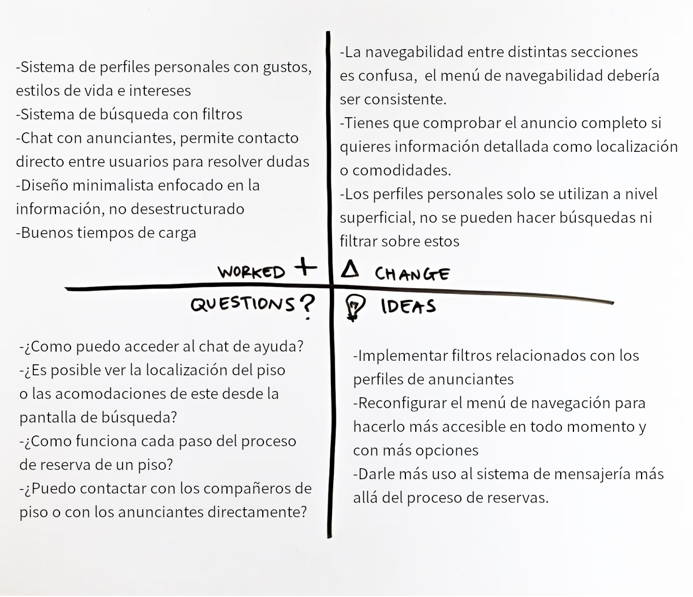

La aplicación que vamos a diseñar será un programa de compartir alojamiento en el que los usarios podrán publicar anuncios o responder a estos. Tomará como base los puntos fuertes de Badi, su enfoque en los usuarios y sus perfiles, y buscará implementar mejoras en este sistema para hacerlo mucho más User-friendly, hacer uso del sistema en el proceso de búsqueda de pisos y ofrecer más funcionalidades en torno a este.

Las funciones principales de la aplicación serán la creación de publicaciones y las reservas de estas. Los usuarios podrán registrarse en la aplicación rellenando los datos relevantes como correo o usuario. Tras rellenar los datos obligatorios, se invita al usuario a completar su perfil rellenando una lista con sus intereses, gustos, personalidad... Esta parte del proceso vendrá precedida por una corta explicación del sistema y de como se utilizará a la hora de realizar búsquedas.

Una vez registrados, los usuarios tendrán acceso a las funcionalidades principales del programa: por un lado podrán crear una publicación para ofrecer una habitación o alojamiento. En la sección de Publicar Habitación el usuario seleccionará, en primer lugar, las distintas características del alojamiento: tamaño de la propiedad, cantidad de habitaciones puestas en oferta, número...  Una vez especificados los detalles del piso, se invitará al usuario a escribir una descripción de la publicación y acompañarla con al menos 1 fotografía y máximo 20.

Por otro lado, los usuarios pueden realizar una búsqueda de publicaciones, introduciendo el nombre de un lugar a través del buscador o del mapa provisto por Google Maps. Alternativamente, también se pueden buscar Alojamientos cercanos al usuario usando su ubicación GPS.

Al realizar una búsqueda, se mostrará una pequeña previsualización con el nombre de cada publicación, una miniatura con las fotografías del piso, el nombre del anunciante, y una pequeña descripción consistente de la locanización aproximada y de iconos que representan las acomodaciones especificadas por el anunciante. También se podrán filtrar los resultados obtenidos, existiendo filtros segun las características de las viviendas, o las características de los inquilinos y personas que viven en el alojamiento.

Para aumentar el tiempo de uso de la aplicación y ofrecer más funcionalidades, se implementará un sistema de mensajería integrado en la aplicación. Los usuarios podrán contactar con cualquier anunciante que encuentren para aclarar cualquier duda sobre el alojamiento publicitado, o pedir información adicional. Este chat será accesible en todo momento. El usuario también podrá contactar con otros usuarios que consten como habitantes del alojamiento, para pedir opiniones o conocerles antes de saber si elegir esta oferta u otra. 

El usuario podrá registrar su perfil como privado o público, siendo la primera la opción por defecto. En caso de que el perfil de un usuario sea privado, aquellos que quieran abrir una conversación con esta persona deberán mandar una solicitud que tendrá que ser aceptada por esta persona antes de que pueda comenzar el intercambio de mensajes.

Si una persona acepta una oferta y realiza una reserva, será incluida automáticamente en un grupo generado por la aplicación con el anunciante y los miembros del piso. El usuario podrá mantenerse en contacto con sus compañeros de piso y con el inquilino sin necesidad de compartir datos personales con otros usuarios, como número de teléfono, si este no lo desea.

La aplicación ofrecerá la opción de abrir una ventana de chat de ayuda en cualquier momento. En caso de seleccionar esta opción, se abrirá un chat en tiempo real con un representante de la compañía a través de una ventana emergente, la cual podrá ser ocultada y desplegada pulsando una pestaña en la esquina superior derecha. Esto permite al usuario recibir ayuda en cada paso del proceso de alquilar un piso o realizar una publicación sin pausar la actividad e este, y de manera interactiva.

----------------------------------------------------

 ## 2.b Sitemap & Task flow

Se hará uso de una matríx de tareas/usuarios (User/task matrix) para enumerar las distintas tareas que se podrán realizar en la aplicación y que tipo de usuarios serán los que más las realicen.

H = high; M= medium, and L = Low

| Grupos de usuarios/tareas                         | Usuarios sin registrar | Usuarios registrados: compradores | Usuarios registrados: anunciantes |
| ------------------------------------------------- | ---------------------- | --------------------------------- | --------------------------------- |
| **Registrarse en la aplicación**                  | H                      |                                   |                                   |
| **Acceder a la aplicación**                       |                        | H                                 | H                                 |
| **Crear un perfil personal**                      | H                      |                                   |                                   |
| Modificar perfil personal                         |                        | M                                 | M                                 |
| **Abrir menú de navegación**                      | H                      | H                                 | H                                 |
| **Realizar una búsqueda de alojamientos**         | H                      | H                                 | M                                 |
| **Usar filtros de resultados según la vivienda**  | M                      | H                                 | L                                 |
| Usar filtros de resultados según perfil personal  | L                      | H                                 | L                                 |
| **Consultar detalles de anuncios de alojamiento** | H                      | H                                 | L                                 |
| Reportar un anuncio                               | M                      | M                                 | L                                 |
| Realizar una reserva                              |                        | H                                 | L                                 |
| **Publicar un anuncio**                           |                        | L                                 | H                                 |
| Modificar un anuncio publicado                    |                        | **L**                             | **M**                             |
| **Acceder a mensajes personales**                 |                        | H                                 | H                                 |
| Mandar solicitud de mensaje                       |                        | H                                 | H                                 |
| Solicitar chat de ayuda                           | M                      | H                                 | H                                 |
| **Usar chat de ayuda**                            | M                      | H                                 | H                                 |
| Buscar preguntas frecuentes (FAQ)                 | M                      | M                                 | M                                 |
| **Modificar ajustes de la aplicación**            | M                      | H                                 | H                                 |

Se ha elegido categorizar a los usuarios en los tres principales grupos que usarán la aplciación: por un lado, los usuarios no registrados, que están utilizando la aplicación sin haber pasado por el proceso de registro y/o acceso y por otro lado, tenemos a los usuarios registrados, a los cuales dividimos en dos grupos, aquellos cuya intención es encontrar alojamiento y aquellos que buscan ofertar su propio alojamiento.

Los usuarios no registrados podrán realizar búsquedas, ver las distintas ofertas y filtrarlas, además de acceder al chat de ayuda y a la sección de preguntas frecuentes, entre otros, pero no podrán realizar reservas ni ponerse en contacto con ningún usuario a través del sistema de mensajería. Todas estas funcionalidades podrán ser utilizadas una vez el usuario se registre.

Se ha resaltado en negrita las funciones más críticas, en las que se centrará el desarrollo de la aplicación.

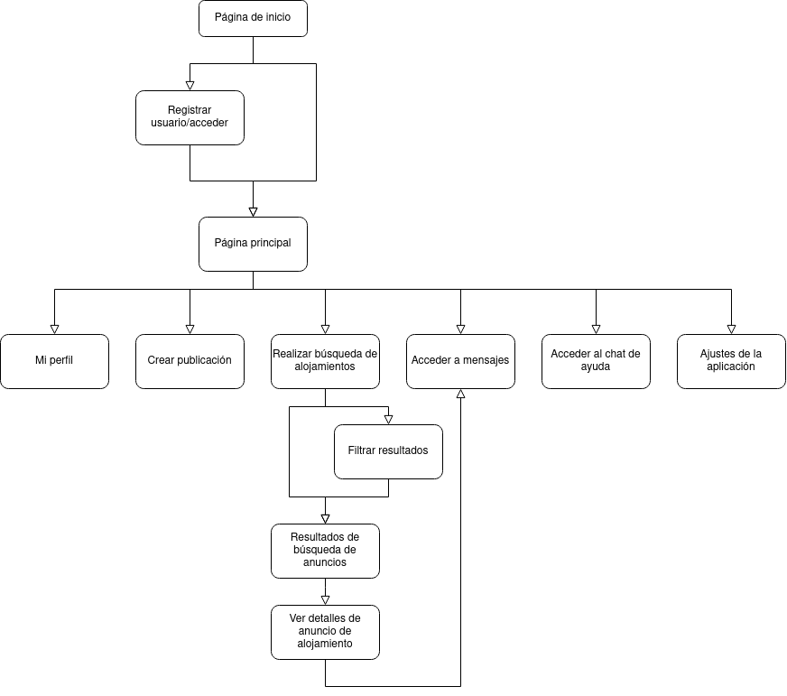

En el Sitemap queda reflejado el flujo que seguirá la página. Además de lo representado en este mapa, cabe resaltar que además de los posibles caminos representados en el mapa, también se dispondrá de una barra de navegación con enlaces a las secciones más importantes, incluyendo un enlace al chat de ayuda que se abrirá como ventana emergente sobre la página, permitiendo contactar con los desarrolladores sin interrumpir el proceso.

----------------------------------------------------

 ## 2.c Labelling

A continuación se detallan las distintas etiquetas utilizadas en el diseño de la aplicación junto con su descripción e iconografía.

| Etiqueta          | Descripción                                                  | Icono                                |
| ----------------- | ------------------------------------------------------------ | ------------------------------------ |
| Menú emergente    | Se pulsa para abrir el menú de navegación emergente          |     |
| Página de inicio  | Lleva a la página de inicio de la aplciación, que recoge la mayoría de las opciones de la app, como publicar anuncios o realizar búsquedas, ver notificaciones, o ver ofertas destacadas u otro contenido relevante. |   |
| Búsqueda          | Lleva a la páquina de Búsqueda en la que se puede realizar búsquedas por escrito, búsquedas recientes o por ubicación |         |
| Realizar búsqueda | Barra de búsqueda de ofertas en la sección de Búsqueda       |                                      |
| Filtrar           | Lleva al usuario a la página de Filtrar, que permite seleccionar filtros para los resultados de la búsqueda. |         |
| Realizar reserva  | Permite al usuario realizar una reserva en un anuncio específico. | Botón con texto                      |
| Mensajes          | Lleva a la página personal de mensajes, donde el usuario puede ver y contestar a mensajes personales o a través de grupos. |         |
| Notificaciones    | Lleva a la página de Notificaciones, donde el usuario puede revisar las notificacione srecibidas previamente. |     |
| Perfil            | Representa el perfil del usuario activo en la aplicación y adicionalmente el de otros usuarios. |              |
| Ayuda emergente   | Se pulsa para abrir la ventana emergente de ayuda.           |          |
| Chat de ayuda     | Abre el chat de ayuda como ventana emergente.                |  |
| F.A.Q.            | Representa la sección de F.A.Q. (Preguntas Frecuentes)       |        |
| Configuración     | Representa la configuración tanto de la aplicación como de los perfiles y anuncios. |               |
----------------------------------------------------

## 2.d Wireframes

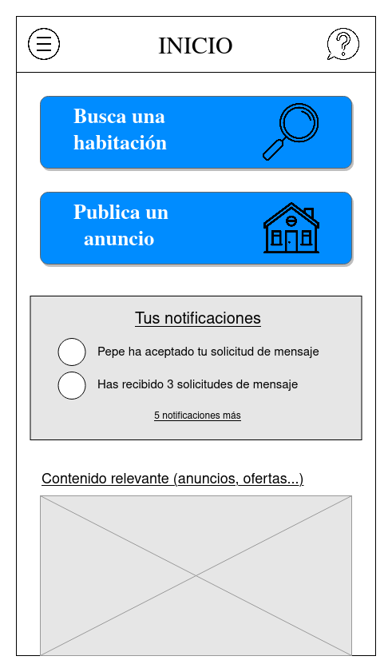

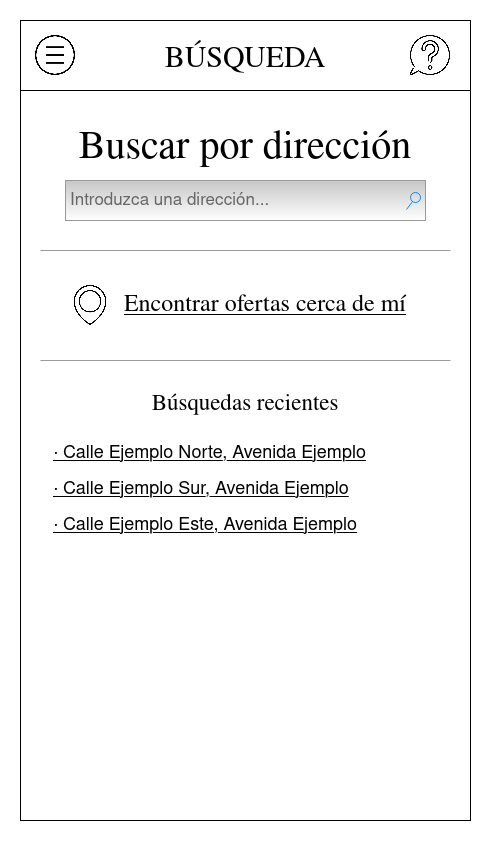

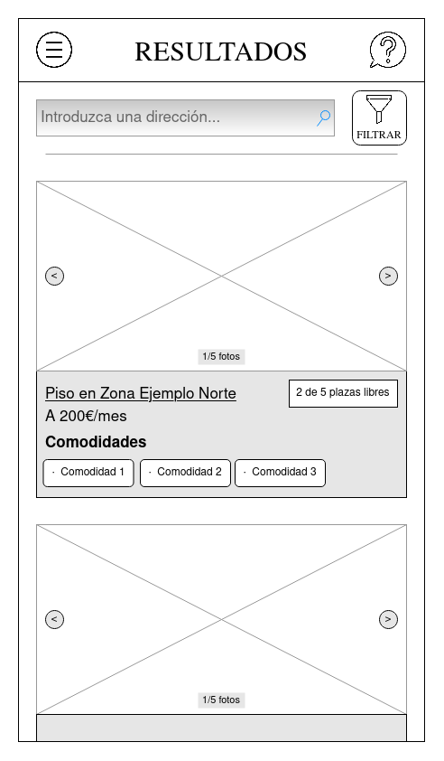

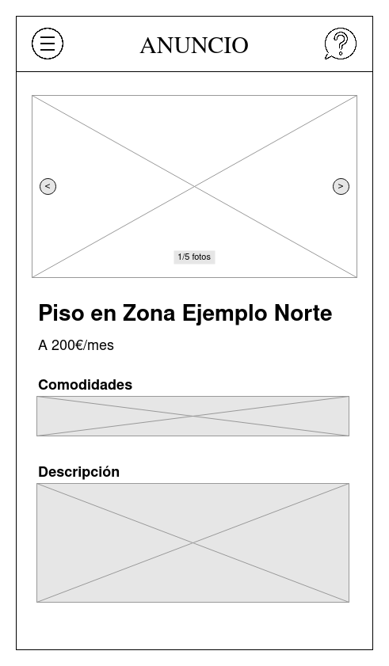

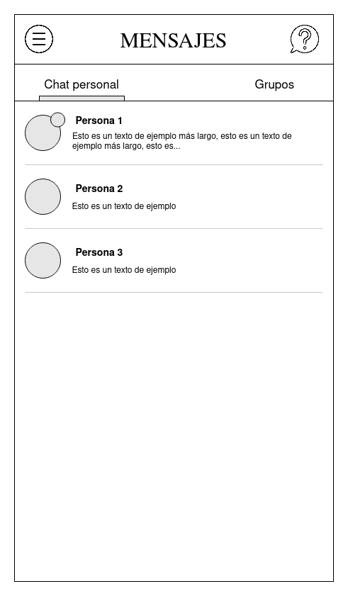

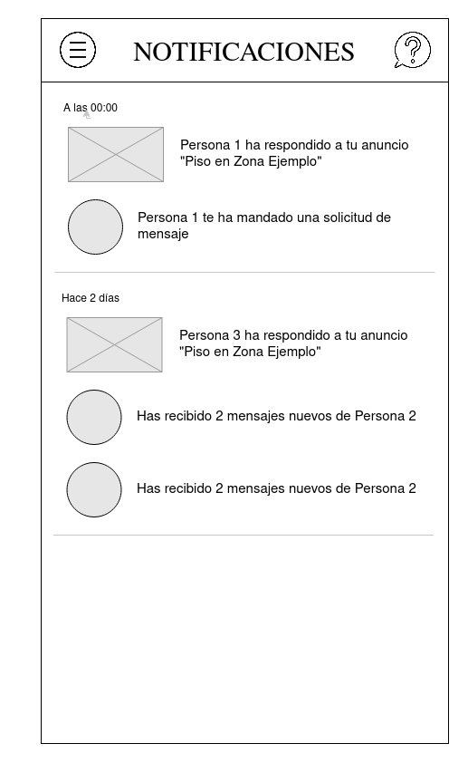

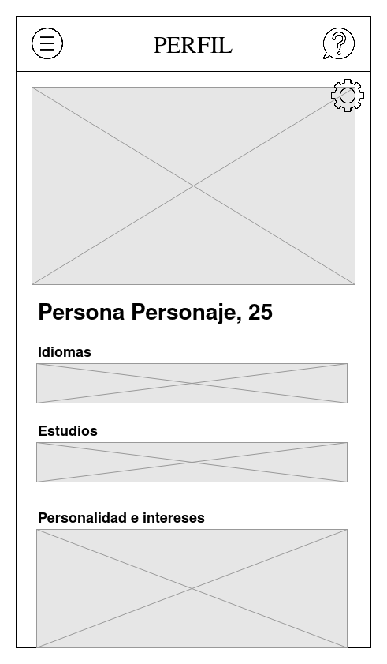

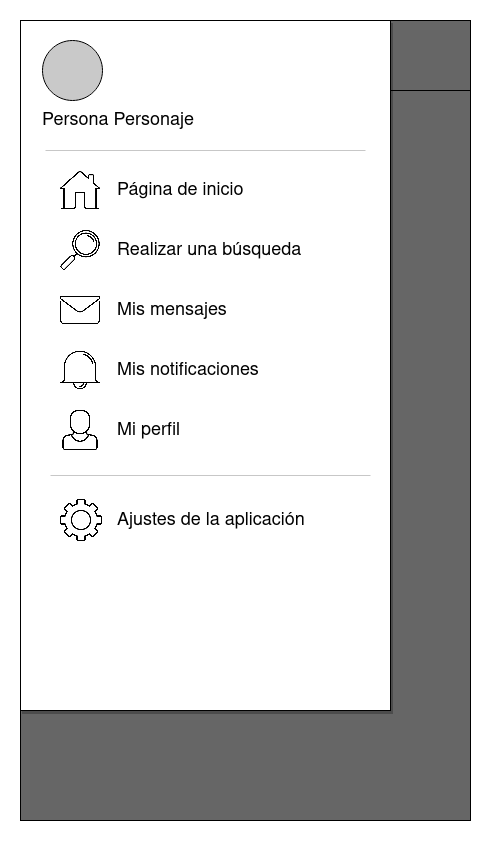

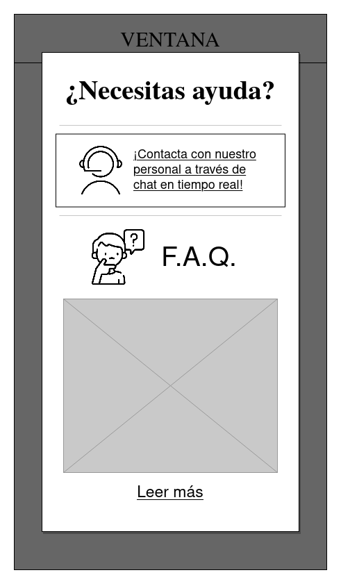

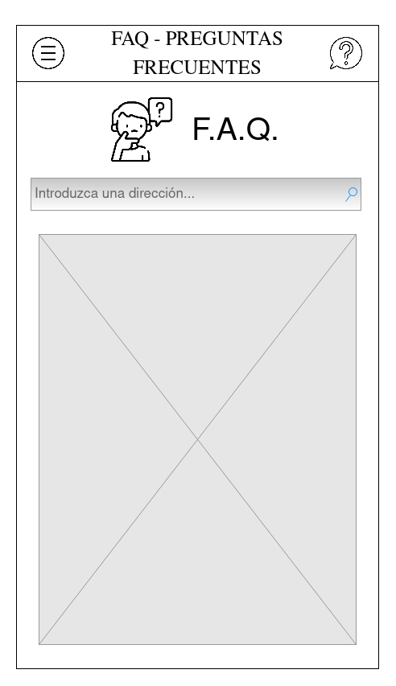