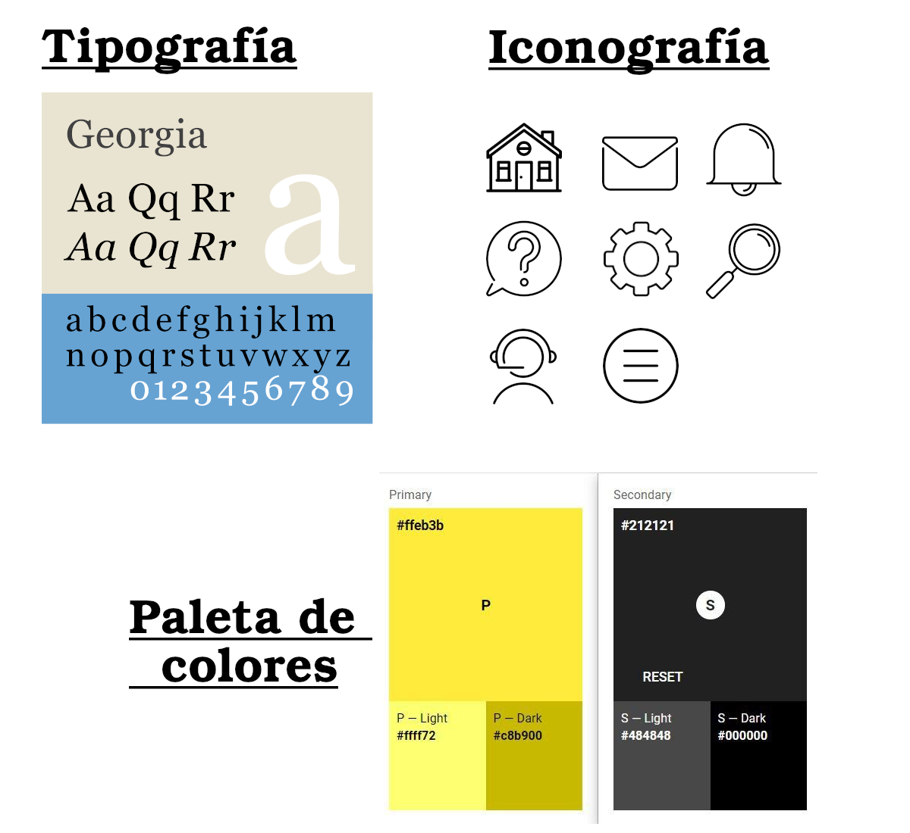

# DIU - Practica 3, entregables
- Análisis de MuseMap 
- Propuesta de elementos de diseño o patrones a usar 
- Historia en Video del UX Case Study
- Documentación. Valoración del equipo sobre la realización de esta práctica o los problemas surgidos

----------------------------------------------------

## 3.a Análisis de MuseMap 
Nuestro primer objetivo será analizar el UX Case Study de la aplicación ficticia **MuseMap Street Art App**, el cual puede ser encontrado en [el siguiente enlace] [https://blog.prototypr.io/musemap-street-art-app-ux-case-study-9bec6a99823b]. Observaremos la estructura utilizada en el UX Case Study para analizar las necesidades de los usuarios y crear la aplicación más conforme a estas.

El Case Study se abre con un pequeño párrafo de introducción que informa al lector del concepto incial que se va a explorar con este prototipo. La pregunta "Who is the artist?" sirve para sintetizar en una frase la idea sobre la que se construirá la aplicación. Acto seguido, se define la duración del proyecto y los integrantes del equipo que se encargarán de desarrollarlo.

En primer lugar, se define el objetivo establecido por el cliente (en este caso, promover la difusión del arte y el cononocimiento artístico e histórico), y a partir de este se definen las diversas posibilidades que se podrían realizar para cumplir estos objetivos.

El siguiente paso consiste en investigar sobre los usuarios que harán uso de este producto. Antes de comenzar, se realiza un estudio del usuario (User Research). Primero se hacen asunciones sobre que es lo que el usuario puede querer o necesitar. Estas ideas se constatan después: se realiza una investigación contextual (Contextual Inquiry) en la que se observa al usuario objetivo. Todas la información obtenida se plasma y se ordena en un Mapa de Empatía para ayudar a comprender más fácilmente al usuario y lo que busca.

Durante este proceso también se realiza un Análisis Competitivo en el que se observa las distintas  características de otras aplicaciones del mismo campo para comprobar cuales poseen en común y cuales podrían ser incluidas para mejorar la experiencia de usuario.

Por último, se realizan entrevistas a usuarios para obtener información sobre estos de manera directa.

Toda esta información se ordena a mayor escala, junto con todas las ideas que surjan durante el proceso, en un Affinity Map que permite sintetizarlas.

Después, se crean 2 User Personas, con el objetivo de observar en mayor detalle las Metas y Frustaciones de los usuarios objetivos. Se crean un User Journey y Experience Map para cada usuario. Esto ayuda a plantear distintos problemas y como podrían ser solucionados por la aplicación que se busca desarrollar.

Tras lograr definir el problema principal y las soluciones que se pueden ofrecer, se ordenan a trvés de un esquema de User Flow. Este esquema se usará como base para la aplicación.

El siguiente paso del proceso es el diseño de la aplicación. A lo largo de una sesión de ideas se realizar sketches y bocetos inciales sobre el diseño de la aplicación. Se utiliza la técnica de Feature Prioritization para definir que característica de la aplicación son las más fundamentales.

Se crean los primeros prototipos. El primero, wireframes hechos en papel. Se realizan pruebas de usabilidad sobre estos, y se construye un nuevo prototipo sobre los errores encontrados en el anterior. Tras conseguir un prototipo más centrado, este se refina de manera digital y se vuelve a testear. Los prototipos se van refinando gradualmente hasta que logremos conseguir el producto deseado.

Los wireframes son acompañados por un Site Map que permite definir con más profudndidad la nevagación y la comunicación entre estos.

Conforme se refinan los prototipos surge la necesidad de crear una guía de estilo que permita definir mejor las características visuales del proyecto. Se definen, entre otros, tipografía, iconografía, y gama de colores.

Con esto, se termina de definir el concepto inicial de la aplicación.

Se puede apreciar a lo largo de todo el proceso la gran importancia que se pone en  la obsevación del usuario y el planteamiento de la aplicación como una respuesta a sus problemas. Los métodos UX utilizados hacen hincapié en observar al usuario detenidamente para conocer sus verdaderas necesidades, comenzando con una hipótesis de cuales podrían ser estas, y acabando con las constrastacion de esta hipótesis con los hechos recopilados. 

A nivel personal, considero que hubiese sido muy interesante explorar en nuestras prácticas métodos UX como el Contextual Inquiry o el User Interviewing, o en general, métodos relacionados con la interacción con un público real y entrevistable. A la hora de plantear un producto, el contacto directo con usuarios reales es tan importante como el planteamiento de User Personas, ya que permite ver de primera mano los problemas que se buscan explorar, las ideas que el usuario pueda tener debido a sus propias experiencias, o icluso a un nivel más básico simplemente plantearnos puntos de vista que a lo mejor no se nos podrían haber ocurrido por nuestra cuenta. Esta clase de métodos pueden cambiar total y completamente la manera en la que enfocamos nuestro proyecto. 

------

## 3.b Propuesta de elementos de diseño o patrones a usar 

A la hora de plantear el desarrollo de nuestra aplicación Yutaku, y de terminar de refinar nuestro diseño, hemos decidido referenciarnos en los principios de diseño de apps para dispositivos móviles, los cuales comparte Google a través de think with Google, y que se pueden encontrar [en el siguiente enlace.](https://www.thinkwithgoogle.com/_qs/documents/1714/Google_Guia_UX_uBbvE4i.pdf)

Los principios presentados por Google ofrecen unas pautas a seguir para optimizar la experiencia de usuario, mejorando la navegación de la app, su disposición de la información, su interacción con el usuario a través de registros, formularios... 

Se ha tomado la decisión de seguir estos veinticinco principios de diseños dado que la gran mayoría se pueden aplicar a las áreas cubiertas por nuestra aplicación: sección de búsquedas, sección de pago, registro y modificación de datos... entre muchas otras páginas. Se ha llegado a la conclusión de que seguir estas pautas, cuando sea posible y razonable, puede dar lugar a un diseño mucho más atractivo y user-friendly.  

Algunos de los principios más importantes entre los elegidos para ser aplicados a nuestro proyecto han sido:
- Dar prioridad a las acciones más importantes de la aplicación, abordándolas de manera clara y poniéndolas en primer lugar.
- Una ventana de búsqueda más eficaz, facilmente accesible, con una indexación de búsqueda correcta, opciones de filtrado y ordenado...
- Opciones de pago variadas y simplificadas, con la posibilidad de almacenamiento de datos de pago para facilitar futuros pagos
- Registro y acceso bien distinguidos, simplificados y fáciles de completar

### Logotipo

Se han creado los siguientes logos para la aplicación.

### Guía de estilo

Se ha compuesto la siguiente guía de estilo como referencia para el diseño detallado de la aplicación.

Se ha elegido el uso de la tipografía Georgia al ser una tipografía simple y fácilmente legible, sin excesivas decoraciones. Se utilizarán variantes en negrita, cursiva, subrayado... si es necesario.

Se hará uso de un diseño minimalista, por lo que la paleta de colores dispondrán de una selección reducida de colores más llamativos de los que se hará un uso más reducido y controlado, limitándose al resaltado de títulos y secciones, y otros puntos de interés.

-----

## 3.c Historia en Video del UX Case Study

Se ha realizado un vídeo en el que se sintetizan las características de nuestro proyecto, y se explica al usuario el proceso de Case Study que hemos realizado para llegar a nuestro producto.

Se puede acceder al video a través del [siguiente enlace.](https://youtu.be/N9TjQsbekaM)

-----

## 3.d Documentación. Valoración del equipo sobre la realización de esta práctica o los problemas surgidos

El ejemplo del UX Case Study de MuseMap Street Art nos sirve para ver como sería un Case Study realizado por un equipo profesional, con experiencia en la materia, pero además, nos permite ver la gran cantidad de distintos Métodos UX que se pueden llevar a cabo durante un estudio con el objetivo de conseguir la mejor UX. 

Usándola de ejemplo, hemos podido ver cómo se podría estructurar mejor los Métodos UX que hemos ido realizando, además de detalles que a lo mejor se nos han escapado durante el diseño de nuestra aplicación o en la manera en la que hemos presentado nuestros personajes. A nivel personal, considero que nuestro proyecto es más consistente que antes y que ahora es mucho más fácil de entender y accesible para todo aquel que quiera leerlo.

