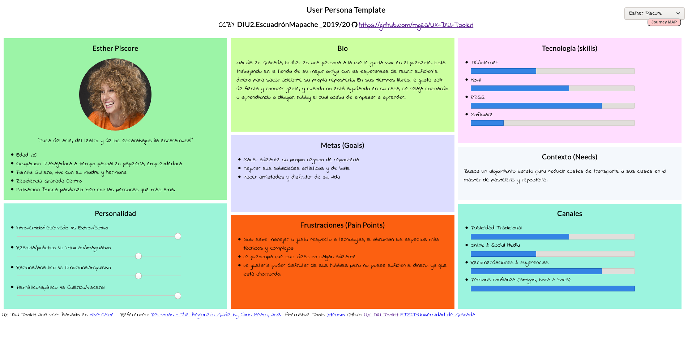
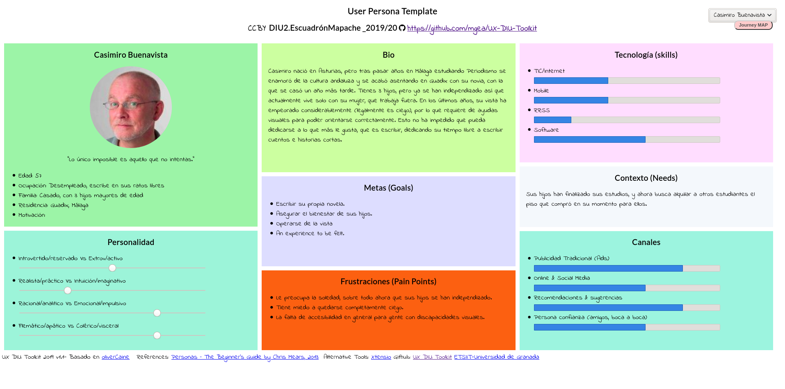
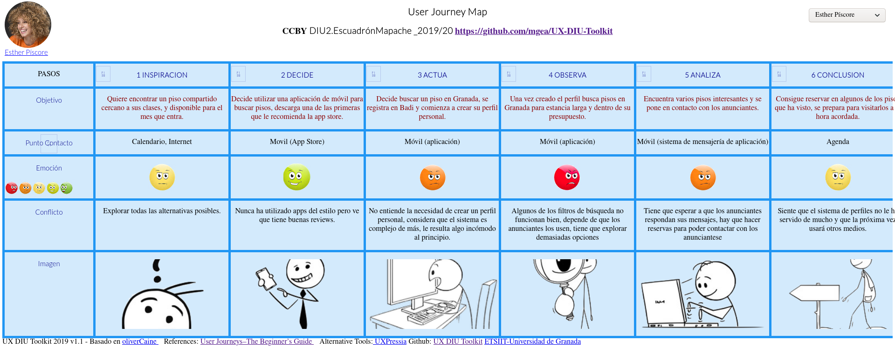
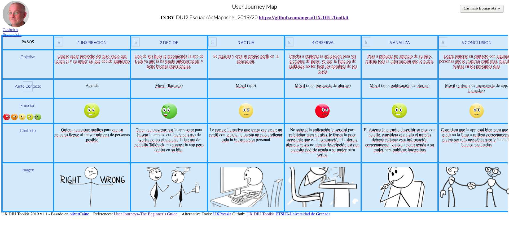
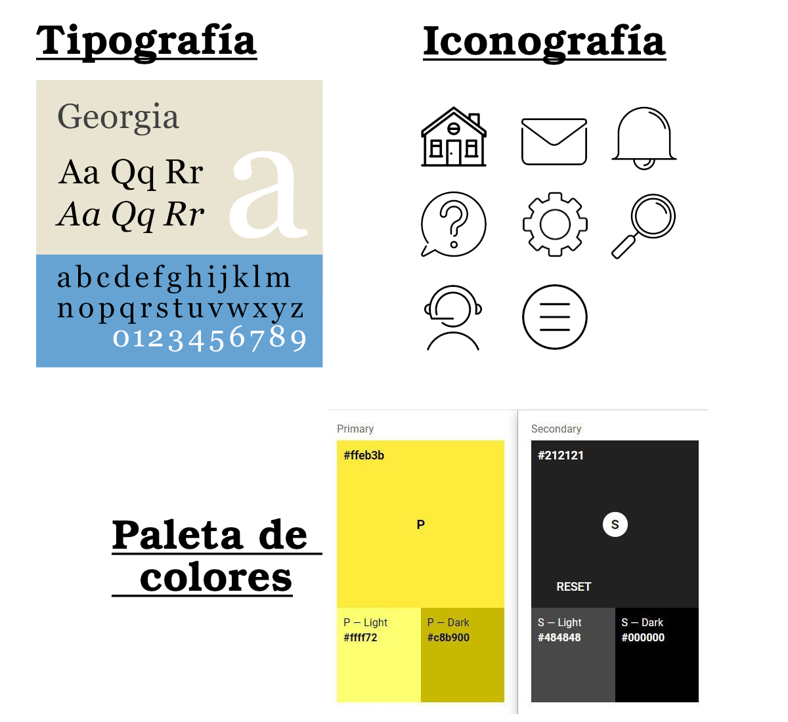

# DIU20
Prácticas Diseño Interfaces de Usuario 2019-20 (Economía Colaborativa) 

Grupo: DIU2_EscuadrónMapache.  Curso: 2019/20 

Proyecto: Yutaku

Descripción: Aplicación movil de alquiler de viviendas en la que el usuario pdorá realizar búsquedas de piso con filtros de hhabitación y personas, además de mantenerse en contacto y conocer a otras personas con las que vivir.

Logotipo: 

Miembros:
 * :bust_in_silhouette:   [Pablo Vallejo Ruiz]: https://github.com/Galactic-O   ​     :octocat:     

-----

En esta práctica estudiaremos un caso de plataforma de economía colaborativa y realizaremos una propuesta para su diseño Web/movil, haciendo uso de herramientas y entregables descritos en [el siguiente CheckList.](https://github.com/mgea/UX-DIU-Checklist) 

## User Research:

Para obtener información sobre nuestro cliente objetivo y sus necesidades realizaremos un User Research, consistente en los siguiente Métodos.

 ### Competitive Analysis:

Observaremos aplicaciones para compartir alojamiento - permiten buscar habitaciones para compartir y poner en alquiler nuestras ubicaciones. Badi es una app móvil gratuita, que se diferencia de otras apps por su sistema de perfiles, que facilita encontrar personas de gustos similares, asegurando una experiencia de convivencia mucho más personalizada.

### User Personas:

Hemos creado 2 user personas para ayudarnos a indentificar las metas y fristraciones de nuestro usuario objetivo. Hemos creado los dos siguientes user personas:

El primer usuario, Esther:

Se ha escogido este usuario para representar a un demográfico bastante común, una juventud sociable pero con poca experiencia a la hora de usar aplicaciones específicas.

Y el segundo usuario, Casimiro:

Este usuario ha sido escogido con la idea de explorar la accesibilidad que puede o no tener la aplicación - un tema comúnmente ignorado y de extrema importancia a la hora de desarrollar una interfaz.

### User Journey Map:

Se han escogido estas dos experiencias de usuario con el objetivo de explorar dos problemas que muy facilmente podrían surgir durante el uso de la aplicación y que nos permiten reflexionar sobre que mejorar en nuestra aplicación.

### Usability Review:

A partir de lo observado en las experiencias de usuario que hemos planteado, y después de que nuestro equipo realizase un análisis práctico de la página ejemplo, se ha redactado la siguiente Usability Review. La revisión de usabilidad a través del [siguiente enlace.](P1/Usability-review.pdf)

· Valoración final: 80

· Comentario: Badi posee una buena base y un buen diseño inicial, pero posee algunos fallos que empeoran la UX Experience. Si estos puntos se tratasen, se podrían hacer relucir aún más los puntos fuertes de Badi y mejorar la experiencia de usuario significantemente.

### Feedback Capture Grid:

Se ha redactado el siguiente Feedback Capture Grid con el objetivo de recopilar toda la infromación obtenida hasta ahora, para facilitarnos su uso y su análisis.

  

Se puede encontrar el análisis detallado, con el análisis de los problemas de la aplicación y la propuesta de valor alcanzada en [el siguiente enlace.](P2/readme.md)

## UX Design

Una vez terminado el User Research y tras haber recabado toda la información de las necesidades y frustaciones de los usuarios, pasamos al diseño de nuestra aplicación.

### Feature Prioritisation (User/task matrix):

Se ha hecho uso de una matriz de tareas/usuarios para enumerar las distintas tareas que se pueden realizar en la aplicación y que tipo de usuarios serán las que más las realicen. Esto nos ayudará a saber en que tareas centrar nuestra atención a la hora de diseñar la app.

H = high; M= medium, and L = Low

| Grupos de usuarios/tareas                         | Usuarios sin registrar | Usuarios registrados: compradores | Usuarios registrados: anunciantes |
| ------------------------------------------------- | ---------------------- | --------------------------------- | --------------------------------- |
| **Registrarse en la aplicación**                  | H                      |                                   |                                   |
| **Acceder a la aplicación**                       |                        | H                                 | H                                 |
| **Crear un perfil personal**                      | H                      |                                   |                                   |
| Modificar perfil personal                         |                        | M                                 | M                                 |
| **Abrir menú de navegación**                      | H                      | H                                 | H                                 |
| **Realizar una búsqueda de alojamientos**         | H                      | H                                 | M                                 |
| **Usar filtros de resultados según la vivienda**  | M                      | H                                 | L                                 |
| Usar filtros de resultados según perfil personal  | L                      | H                                 | L                                 |
| **Consultar detalles de anuncios de alojamiento** | H                      | H                                 | L                                 |
| Reportar un anuncio                               | M                      | M                                 | L                                 |
| Realizar una reserva                              |                        | H                                 | L                                 |
| **Publicar un anuncio**                           |                        | L                                 | H                                 |
| Modificar un anuncio publicado                    |                        | **L**                             | **M**                             |
| **Acceder a mensajes personales**                 |                        | H                                 | H                                 |
| Mandar solicitud de mensaje                       |                        | H                                 | H                                 |
| Solicitar chat de ayuda                           | M                      | H                                 | H                                 |
| **Usar chat de ayuda**                            | M                      | H                                 | H                                 |
| Buscar preguntas frecuentes (FAQ)                 | M                      | M                                 | M                                 |
| **Modificar ajustes de la aplicación**            | M                      | H                                 | H                                 |

### Sitemap:

Se ha creado un sitemap en el que queda reflejado el flujo que seguirá la página a nivel de navegación. En él quedan representadas las tareas que hemos considerado más relevantes para el uso de la aplicación.

### Labelling :

A continuación detallamos las distintas etiquetas utilizadas en el diseño de la aplicación junto con su descripción e iconografía.

| Etiqueta          | Descripción                                                  | Icono                                   |
| ----------------- | ------------------------------------------------------------ | --------------------------------------- |
| Menú emergente    | Se pulsa para abrir el menú de navegación emergente          |     |
| Página de inicio  | Lleva a la página de inicio de la aplciación, que recoge la mayoría de las opciones de la app, como publicar anuncios o realizar búsquedas, ver notificaciones, o ver ofertas destacadas u otro contenido relevante. |   |
| Búsqueda          | Lleva a la páquina de Búsqueda en la que se puede realizar búsquedas por escrito, búsquedas recientes o por ubicación |         |
| Realizar búsqueda | Barra de búsqueda de ofertas en la sección de Búsqueda       |                                         |
| Filtrar           | Lleva al usuario a la página de Filtrar, que permite seleccionar filtros para los resultados de la búsqueda. |         |
| Realizar reserva  | Permite al usuario realizar una reserva en un anuncio específico. | Botón con texto                         |
| Mensajes          | Lleva a la página personal de mensajes, donde el usuario puede ver y contestar a mensajes personales o a través de grupos. |         |
| Notificaciones    | Lleva a la página de Notificaciones, donde el usuario puede revisar las notificacione srecibidas previamente. |     |
| Perfil            | Representa el perfil del usuario activo en la aplicación y adicionalmente el de otros usuarios. |              |
| Ayuda emergente   | Se pulsa para abrir la ventana emergente de ayuda.           |          |
| Chat de ayuda     | Abre el chat de ayuda como ventana emergente.                |  |
| F.A.Q.            | Representa la sección de F.A.Q. (Preguntas Frecuentes)       |        |
| Configuración     | Representa la configuración tanto de la aplicación como de los perfiles y anuncios. |               |

### Primer prototipo - Wireframes:

Se han creado los primeros prototipos de la aplicación, en forma de wireframes para representar su diseño.

|  |          |       |
| ------------------------------------ | -------------------------- | --------------------------- |
|                   |        |   |
|                    |  |  |
|                       |                            |                             |

## Mi equipo UX-Case Study 

Para mejorar nuestro UX Case Study, y de acuerdo a la práctica, se ha reestrcuturado el formato del archivo readme.md para dotarlo de una estructura más ordenada.

### Análisis del UX Case Study MuseMap Street Art App:

La experiencia MuseApp nos muestra una manera más profesional de plantear un UX Case Study explorando de manera individual cada uno de los métodods UX utilizados. Se puede leer el análisis extendido [aquí.](P3/readme.md) 

### Logotipo de la aplicación:

Se han diseñado los siguientes logotipo e icono para la aplicación desarrollada.

Estos serán utilizados para representar a la aplicación tanto dentro del mismo programa como en redes sociales, publicidad, y otros.

### Guía de estilo:

También se ha desarrollado una guía de estilo en la que se ha definido la tipografía, iconografía, y paletade colores que usará la aplicación.

### Guidelines del proyecto:

A la hora de realizar el diseño final de la aplicación, se ha optado por seguir los principios de diseño de aplicaciones móviles planteados por Google. Esta decisión se explica con más detalle [en el siguiente enlace.](P3/readme.md)

### Vídeo explicativo:

Se ha creado un vídeo en el que se sintetizan las características de nuestro proyecto, y se explica al usuario el proceso de Case Study que hemos realizado para llegar a nuestro producto.

Se puede acceder al video a través del [siguiente enlace.](https://youtu.be/N9TjQsbekaM)

-----

----

## Paso 4. Evaluación 

 4.a Casos asignados
----

>>> Descripción de las asignaciones (3 UX Case Study) y enlace a  sus repositorios.

>>>> En la seccioón P4/readme.md se debe acceder además a sus respectivas hojas de evaluación y conclusiones 

 4.b User Testing
----

>>> Seleccione a una de sus personas ficticias. Exprese las ideas de posibles situaciones conflictivas de esa persona en las propuestas evaluadas

. 4.c Ranking 
----

>>> Concluya con un ranking de los casos evaluados 

>>> Valoración personal 

## Paso 5. Evaluación de Accesibilidad  

  5.a Accesibility evaluation Report
----

>>> Indica qué pretendes evaluar (de accesibilidad) y qué resultados has obtenido + Valoración personal

>>> Evaluación de la Accesibilidad (con simuladores o verificación de WACG) 

## Conclusión final / Valoración de las prácticas

>>> (90-150 palabras) Opinión del proceso de desarrollo de diseño siguiendo metodología UX y valoración (positiva /negativa) de los resultados obtenidos  

